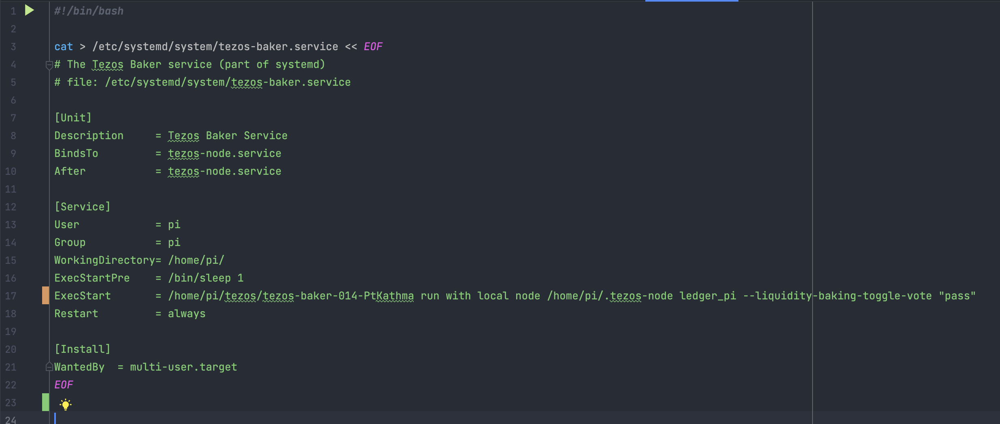
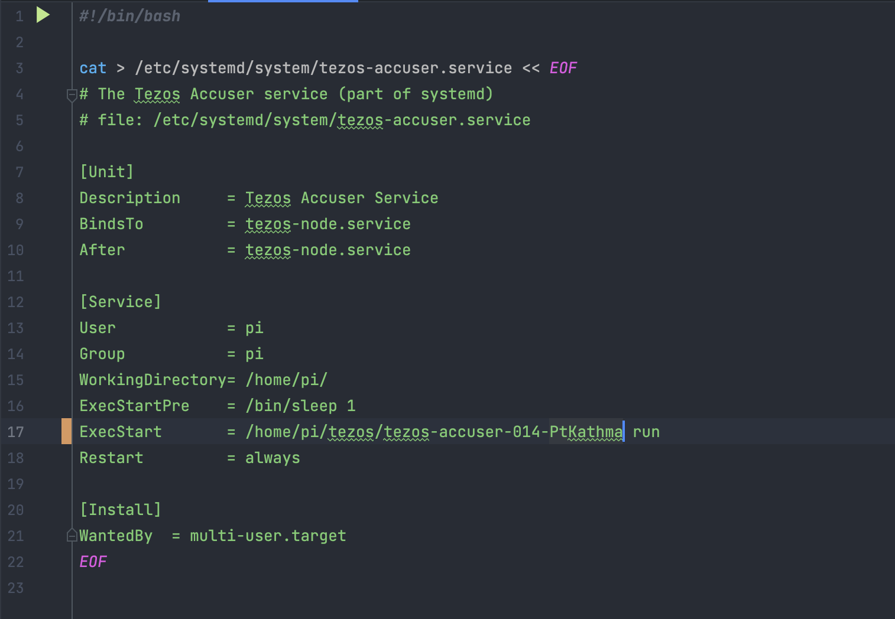

# Setting up Auto-start & monitoring

These files are currently set for the Ithaca Protocol. 
Look at the [NOTE](#note) to ensure you are using the correct commands in your baker and accuser scripts.


##AutoStart
Run the following terminal commands in order
   1. `./tez-node.sh`
   2. `./tez-baker.sh`
   3. `./tez-accuser.sh`
   4. `./index.sh`

You can use the `restart-all.sh` and `stop-all.sh` files to restart/stop the services when you need to.

### Updating the commands in the above files
1. Run the following to stop and verify stoppage
    ```shell
    sudo systemctl stop tezos-node.service
    sudo systemctl status 'tezos-*.service'
    ```
2. Update any of the files you need with the correct lines, take a look at the [NOTE](#note) if it's for the Psithaca upgrade
   1. To modify the `[Install]` section (you will have to in the tez-node.sh file), you will have to re-enable the service after the update
   ```shell
        sudo systemctl reenable SERVICEFILENAME
    ```
3. Run the following after updating any of the .service files of your system as the system needs to be notified of any changes:
    ```shell
        systemctl daemon-reload
    ```
4. Restart all services:
    ```shell
        sudo systemctl reload-or-restart tezos-node.service
    ```
5. Verify the Node, Baker, and endorser processes are all running:  
    ```shell
      sudo systemctl status 'tezos-*.service'
    ```
   

###NOTE:
If your tezos-baker and tezos-accuser are not named after the protocol:
`tezos-baker`, `tezos-accuser` instead of `tezos-baker-012-Psithaca` and `tezos-accuser-012-Psithaca` then make sure to update
line 17 of the tez-baker.sh and tez-accuser.sh files to use `tezos-baker`, `tezos-accuser` instead respectively

###tez-baker.sh


###tez-accuser.sh



##Monitoring
Coming soon :)  

**Helpful links:**

1. [Coincashew](https://www.coincashew.com/coins/overview-xtz/guide-how-to-setup-a-baker/monitoring-and-autostart)
