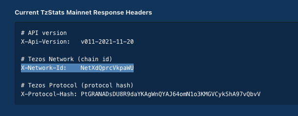

# Tezos Node and Bakery setup for a Raspberry Pi

Welcome!
This is a SDK for setting up a Tezos Node and Bakery on a Raspberry Pi.

First off, this SDK assumes that you already have a Raspberry Pi up and running with a 64-bit OS.
To get started, you have to make the scripts you will run to be executable. That simply requires
running ```sudo chmod u+x filename.sh```.

Now that's done, here are the steps you need to follow:
1. Run initial_setup.sh: ```./intial_setup.sh```
2. [Download and import the latest Tezos snapshot](#downloading-and-importing-a-snapshot)
3. [Starting the Node](#starting-the-node)
4. [Setting up our Ledger Nano S](#setting-up-our-ledger-nano-s)
5. [Registering as a baker](#registering-as-a-baker)
6. [Getting the Bakery up and running](#getting-the-bakery-up-and-running)
7. [Setting up auto-restart and monitoring for your node](#setting-up-auto-restart-and-monitoring)


## Downloading and importing a snapshot
I prefer to get the snapshots from [mainnet.xtz-shots.io](https://mainnet.xtz-shots.io/). Scroll down to the Rolling snapshot section of the page. The command you need to run in your terminal looks like this:
```
wget https://mainnet.xtz-shots.io/tezos-mainnet-1959969.rolling
./tezos-node snapshot import tezos-mainnet-1959969.rolling --block BM4MFDJV3tPnRUxgrcsWUNNoYNSaiZCgEV64LJLxNwBQRLApgQz
```

Where the numbers `1959969` and blockhash `BM4MFDJV3tPnRUxgrcsWUNNoYNSaiZCgEV64LJLxNwBQRLApgQz` aren't necessarily the same.

## Starting the Node
After the Snapshot download, we are going to sync our node with that of the rest of the blockchain. For that to happen we need to get all of the blocks that weren't in the snapshot we downloaded.  
To do that, run `./node_start.sh` and you can see its progress by running `tail -f tezos.log` in a separate terminal

Now, you might wonder how we check if our node is ready. We will know its ready once we see ```Node is Bootstrapped``` printed out into the CLI. To check on the node's progress, you can run ```./tezos-client bootstrapped``` from inside the tezos directory in a **NEW** terminal.

While we are waiting for our Node to be bootstrapped, lets setup our Ledger Nano S.


## Setting up our Ledger Nano S
We are using the ledger as the wallet for our baking and for that to happen, we need to set it up. So yalla:

#### Setting up ledger live and wallet on your home computer (not the Raspberry Pi)
1. Break out your computer and download the [Ledger Live software](https://www.ledger.com/ledger-live/download)
2. Follow the setup instructions for the ledger wallet.
3. Once that's done, we need to install 2 app onto the wallet: Tezos Wallet and Tezos Baking
4. Connect your Ledger, enter the pin, and open Ledger Live (if you haven't already done these steps)
5. Go into the Manager Screen of the Ledger Live and click **Allow Ledger Manager**
6. You might have to enter dev mode to allow to apps to be installed
7. Once that's done, search for **Tezos Wallet** and **Tezos Baking** in the app catalog and install them both onto the wallet.

#### Setting up your ledger with the Raspberry Pi
This step should only be done after completing setup of the wallet with the Tezos apps with the Ledger live as mentioned directly above.
1. Connect your ledger to your Raspberry Pi
2. Open up a terminal/CLI and navigate to the tezos directory. pssst its ```cd ~/tezos```
3. Run ```./octez-client list connected ledgers```
4. If everyone is good to go with the Pi and your ledger then you should see something like the following:
    ```
   ## Ledger 'happy-funny-moody-fun'
   Found a Tezos Wallet 2.1.0 (git-description: "091e74e9") application running on Ledger Nano S at  
   [IOService:/AppleACPIPlatformExpert/PCI0@0/AppleACPIPCI/XHC1@14/XHC1@14000000/HS03@14300000/Nano  
   S@14300000/Nano S@0/IOUSBHostHIDDevice@14300000,0].  
   
   To use keys at BIP32 path m/44'/1729'/0'/0' (default Tezos key path), use one of:
   
   tezos-client import secret key ledger_username "ledger://happy-funny-moody-fun/bip25519/0h/0h
   tezos-client import secret key ledger_username "ledger://happy-funny-moody-fun/ed25519/0h/0h"
   tezos-client import secret key ledger_username "ledger://happy-funny-moody-fun/secp256k1/0h/0h"
   tezos-client import secret key ledger_username "ledger://happy-funny-moody-fun/P-256/0h/0h"
   ```
   Where 'happy-funny-moody-fun' is a unique identifier name for your ledger.  


5. Now that we have that info, we need to import the ledgers secret key and decide on the name you want to give your baker.
Once that's done, run:   
```./octez-client import secret key ledger_pi "ledger://happy-funny-moody-fun/ed25519/0h/0h"```  
where ledger_pi is the name you have decided to give your bakery.
6. Now, we are just left with verifying that your ledger account was successfully added and up and running. For that, run:  
```./octezclient list known addresses```  
and you should see your baker's account name and public address.  
  
## Registering as a baker
Please note, while you are baking, you are required to keep your ledger wallet unlocked and open to the Tezos Baking app. If your ledger is off for some reason, then you will miss your baking slot during the time that it was off.  
1. Unlock your ledger and navigate to the Tezos Baking app
2. Open a new terminal and navigate to the `tezos` directory
3. The next command you will run has to variables you need to check on before you run it.
   1. main-chain-id` - it shouldn't ever change but to be safe, go [here](https://tzstats.com/docs/api#tezos-api) and search for it. You are looking for the X-Network-ID:  
   
   2. `ledger_pi` should be replaced with the name you gave your bakery earlier on.
4. Once in the tezos directory, run:  
`./octez-client setup ledger to bake for ledger_pi --main-chain-id NetXdQprcVkpaWU`  
This command will register your ledger and Pi as a bakery.

## Getting the Bakery up and running
Here we will be running multiple scripts, each in separate terminals. They will get the bakery, endorser, and accuser up and running. If your node still isn't bootstrapped, don't worry. It usually takes a couple of hours, depending on the snapshot. Once your node is bootstrapped, you should proceed with the following:
1. Firstly, check and make sure that your node is still running. If not, re-run `./node_start.sh`
2. Open up 2 more terminals/CLIs that you will have dedicated for the following 2 commands (I like to name the terminals/CLIs after their specified command: **Bakery**, **Accuser**), one in each.
3. Run: ```cd tezos && ./octez-baker run with local node ~/.tezos-node ledger_pi --liquidity-baking-toggle-vote <on|off|pass>``` (where: `ledger_pi` is replaced with the name you gave your bakery,`--liquidity-baking-toggle-vote` is passed the value `<on|off|pass>` which you can read more about [here](https://tezos.gitlab.io/kathmandu/liquidity_baking.html))
4. Run: ```cd tezos && ./octez-accuser run``` (where: `ledger_pi` is replaced with the name you gave your bakery)
5. If your node is bootstrapped (fully synced up) then you should see outputs of baking printouts and `accuser activated` from their respective terminals. If not and your node **IS** bootstrapped, then try to debug and make sure you did all the steps correctly and in order. If you encounter any issues, feel free to reach out for help in the Tezos Bakers slack (link at the bottom) 
6. Yalla, you are all good to bake.


## Setting up auto-restart and monitoring
So, your bakery is up and running, Congratz! What happens when there is a power outage, internet cuts out, or something causes your Pi to restart suddenly, and you aren't home to deal with it? Don't worry. I got you :)  
  
#### Autostart Scripts
Take a look at the here to set up Autostart scripts for your bakery [Autostart scripts](./AutoStartScripts/AutoStartScripts.md)

#### Monitoring Scripts
Coming soon...


##### Helpful links:
1. [Tezos baking slack](https://tezos-kiln.org/joinbakingslack)
2. [r/Tezos](https://www.reddit.com/r/tezos/)
3. [Coincashew](https://www.coincashew.com/coins/overview-xtz/guide-how-to-setup-a-baker/monitoring-and-autostart)
